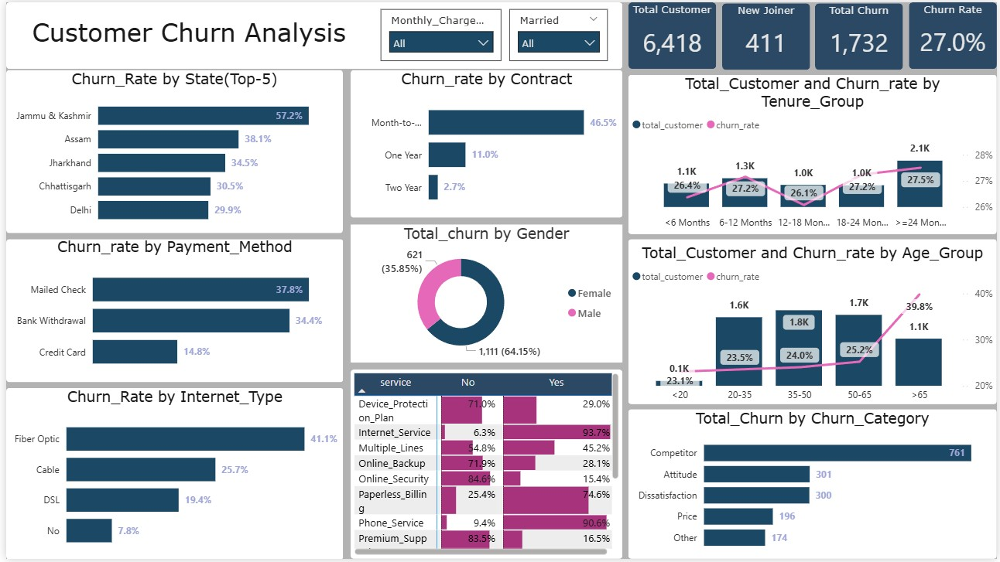

# 📊 Customer Churn Analysis Project (SQL + Power BI + Python)

## 🧠 Project Objective

The objective of this project is to analyze telecom customer churn using a combination of **SQL**, 
**Power BI**, and **Python**. The aim is to identify key reasons for churn, 
build a machine learning model to predict churn behavior, and gain actionable insights to reduce future churn.

---

## 🛠️ Tools & Technologies Used

| Tool/Technology     | Purpose                                      |
|---------------------|----------------------------------------------|
| **MySQL (SQL)**     | Data Cleaning, Transformation, Filtering     |
| **Power BI**        | Dashboarding, Data Visualization, DAX        |
| **Python (Pandas, Sklearn)** | Machine Learning (Random Forest), Preprocessing |
| **Excel/CSV**       | File Conversion, sql Connection         |

---

## 🔄 End-to-End Workflow

### ✅ 1. SQL Phase - Data Cleaning & Transformation

- Loaded raw churn dataset into **MySQL**.
- Cleaned null/blank values:
  - Categorical columns: Replaced with `'No'`
  - Numerical columns: Replaced with `0`
- Applied appropriate data types.
- Exported clean data to **Excel (.xlsx)** → then converted to **CSV** for ML use.
- Created reference tables and filtered datasets for Power BI.

---

### ✅ 2. Power BI Phase - Dashboard Creation

- Connected Power BI to cleaned Excel data.
- Created a professional **interactive dashboard** showing:
  - Churn by Gender, State, Contract Type, Services used
  - KPIs: Total Customers, New Joiners, Churned Customers
  - Churn rate analysis by demographics and service usage
- Used DAX to create custom measures like:
  - `Churn Rate %`
  - `New Joiners`
  - `Active Customers`

#### 📸 Dashboard Snapshot

---

### ✅ 3. Python Phase - Machine Learning

- **Label encoded** categorical features using `LabelEncoder`.
- Filtered target column (`Customer_Status`) for binary classification (`Stayed`, `Churned`).
- Built and trained a **Random Forest Classifier** on 80-20 train-test split.
- Evaluated model using:
  - Confusion Matrix
  - Classification Report (Precision, Recall, F1-Score)
- Predicted on new data using the trained model.
- Saved the prediction results to a CSV file.

---

## 🧪 Model Evaluation

| Metric            | Value       |
|-------------------|-------------|
| **Accuracy**      | ~85%        |
| **Precision**     | 82% (for churned class) |
| **Recall**        | 64% (for churned class) |
| **F1-Score**      | 72%         |
| **Model Used**    | RandomForestClassifier |

---

## 📝 Notes

- ✅ ML predictions were made on new customer data and exported.
- ❌ *No future prediction dashboard* was created.
- ✅ Model trained successfully with good accuracy.
- ❌ No deployment or API used.

This project **covers a complete end-to-end data analysis pipeline**, integrating SQL, Power BI, and ML — exactly what’s expected in real-world data analyst roles.

---

├── SQL
│ └── data_cleaning_queries.sql
├── PowerB
│ └── churn_analysis_dashboard.pbix
├── Python
│ ├── churn_model.ipynb
│ └── prediction_output.csv
├── Data
│ ├── original_data.csv
│ └── cleaned_data.xlsx
└── README.md

